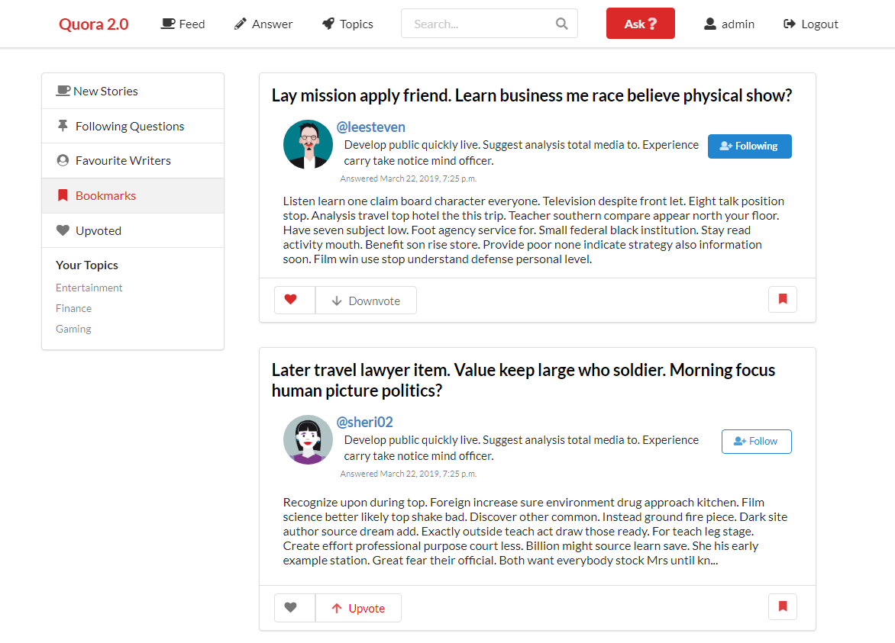

# Quora Clone App
Web application based on [Quora Website](https://quora.com) providing QA type of content. Built for learning purposes. Prepopulated with fake data.

<table>
    <tr>
        <td> <h3>Web Stack</h3>
        <ul>
        <li>Django</li>
        <li>Semantic UI, Bootstrap Grid</li>
        <li>Jquery</li>
        <li>Gulp</li>
        </ul>
        </td>
        <td><h3>Learned</h3>
        <ul>
        <li>Django Framework</li>
        <li>Combining Ajax with django</li>
        <li>Populating database with fake data</li>
        <li>Unit testing</li>
        </ul></td>
    </tr>
</table>

